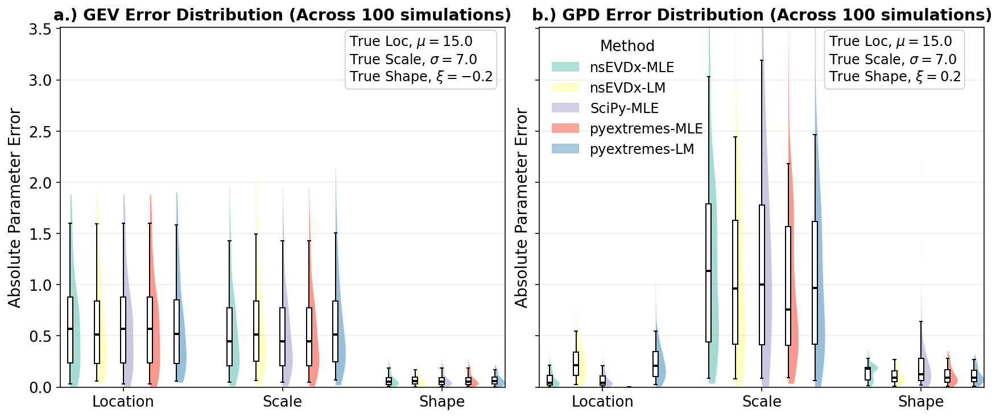

# Summary

nsEVDx is an open-source Python package for fitting stationary and non-stationary Extreme Value Distributions (EVDs) to extreme value data. It supports non-stationary models in which the location, scale, and shape parameters can each depend on user-defined covariates. Overall, nsEVDx provides a Python-native interface for frequentist and Bayesian inference of non-stationary EVD models, enabling researchers and practitioners to quantify changing risks associated with rare and extreme events.


# Statement of Need

Traditional extreme value frequency analysis assumes that the statistical properties of extreme events remain stationary over time. However, non-stationary behavior in extreme events has been documented across hydroclimatic, engineering, and financial applications. For example, in hydroclimatic systems, non-stationary behavior has been documented in flood and extreme-rainfall processes, with changes linked to factors such as urbanization and climate change [@prosdocimi2015detection;@jayaweera2025evidence;@eccles2025substantial]. Such changes can alter the frequency and magnitude of extreme events over time. Accurately quantifying these evolving risks and return periods requires statistical tools that can incorporate arbitrary, time-varying covariates into all EVD parameters.

Although several existing packages support extreme value analysis, modeling non-stationary EVDs requires substantial statistical and programming expertise, particularly when Bayesian sampling algorithms are involved. `nsEVDx` provides an easy-to-use framework for fitting stationary and non-stationary Generalized Extreme Value (GEV) and Generalized Pareto (GPD) distributions. It makes advanced sampling methods accessible to users with varying levels of expertise in extreme value modeling while retaining the flexibility required for advanced applications.

The target audience for nsEVDx includes hydrologists, climate scientists, engineers, and risk analysts who need a reliable, flexible workflow for non-stationary extreme value modeling. By reducing the effort needed to implement both frequentist optimization and advanced Markov Chain Monte Carlo (MCMC) sampling algorithms, the software allows practitioners to focus on understanding changing risks and their implications for decision-making.


# State of the Field

Extreme value distributions (EVDs), particularly the GEV and GPD, are widely used to quantify the frequency and magnitude of rare events in hydrology, climatology, engineering, and finance [@katz2002statistics;@kafle2026robustness;@mcneil2000estimation;@castillo1988extreme]. Increasing evidence of non-stationarity in environmental and socioeconomic systems has motivated the development of methods that allow EVD parameters to vary with time or external covariates.

Several software packages support extreme value analysis. In the R ecosystem, `ismev` [@heffernan_j_e_ismev_2003], `extRemes` [@gilleland_extremes_2025], `climextRemes` [@paciorek_climextremes_2016], and `NSGEV` [@irsn_nsgev_2024] provide tools for fitting stationary and non-stationary extreme value models. These packages provide important foundations for EVD-based analysis, although their capabilities differ in areas such as non-stationary modeling and Bayesian inference. Probabilistic programming frameworks, such as Python-based `PyMC` [@oriol_abril-pla_pymc_2023] and `NumPyro` [@phan2019composable], and `C++`-based Stan with interfaces like `PyStan` [@noauthor_pystan_2023] and `CmdStan` [@noauthor_cmdstan_2023], offer flexible tools for building custom statistical models, including extreme value models. However, these tools require users to formulate non-stationary likelihood functions explicitly for EVDs along with prior specifications, parameter constraints, and sampling configurations for each application. As a result, they may be too complex for domain-specific practitioners like hydrologists, climate analysts, or risk analysts seeking easy-to-use tools. Within Python, `pyextremes` supports extreme value analysis with features such as block maxima and peaks-over-threshold extraction, return-level estimation, frequentist inference through `SciPy`, and Bayesian inference using the affine-invariant ensemble sampler, `emcee` [@emcee]. However, `pyextremes` is primarily focused on stationary extreme value workflows. 

These differences motivate `nsEVDx`, a flexible Python tool that provides a unified framework for both stationary and non-stationary modeling. In particular, `nsEVDx` supports user-defined covariates, parameter constraints, custom priors, and MCMC algorithms such as Metropolis-Adjusted Langevin Algorithm (MALA) and Hamiltonian Monte Carlo (HMC) for fitting non-stationary GEV and GPD models [@michael_betancourt_conceptual_2017;@neal2011mcmc;@roberts_exponential_1996]. Compared with general-purpose probabilistic programming frameworks, `nsEVDx` provides predefined EVD likelihoods, parameterizations, and inference workflows, reducing the amount of model construction required for common extreme value analyses. 


# Software Design
`nsEVDx` is designed to minimize the programming burden typically associated with custom Bayesian implementations while providing a transparent and flexible framework for extreme value modeling. The overall workflow implemented in `nsEVDx` is shown in Figure 1.


The concepts of non-stationarity and MCMC techniques used in `nsEVDx` are based on the foundational texts by @christian_p_robert_introducing_2009 and @coles_introduction_2001. The core class `NonStationaryEVD` handles parameter parsing and specification, log-likelihood evaluation, prior assignment, optimization, and MCMC sampling. This unified design allows users to switch between frequentist and Bayesian workflows without redefining model structures. Frequentist methods use `scipy.optimize` to minimize the non-stationary negative log-likelihood, while the Bayesian MCMC methods are implemented in numpy, allowing full transparency and customization. In Bayesian estimation, `nsEVDx` can infer prior specifications based on the data and configuration or accept user-defined priors. In the frequentist mode, it can determine suitable parameter bounds automatically. However, user-defined priors or bounds are recommended for better convergence and interpretability. The implementation of L-moments in some utility methods follows the approach described by @j_r_m_hosking_regional_1997. Currently, `nsEVDx` supports linear modeling for the location and shape parameters, and exponential (log-linear) modeling for the scale parameter, to ensure positivity.

`nsEVDx` controls non-stationarity via a configuration vector `config = [a, b, c]`, where each entry specifies the number of covariates used to model the location, scale, and shape parameters of the EVD. An entry with a value of `0` implies stationarity (i.e., no covariate dependence), while integer values `> 0` indicate non-stationary modeling using the corresponding number of covariates for the parameter. This representation provides a compact and scalable mechanism for defining a wide range of stationary and non-stationary models while maintaining a consistent user interface (Figure 2). 


Currently, location and shape parameters can be modeled using linear relationships, while the scale parameter is modeled using an exponential link function to ensure positivity. Polynomial relationships can be accommodated by transforming covariates before model fitting. 

Another key design decision is the implementation of Bayesian samplers directly in `NumPy`. This approach maximizes transparency, enables users to inspect and modify algorithmic details, and reduces dependencies. The package currently provides Random-Walk Metropolis-Hastings (RWMH), MALA, and HMC samplers, allowing users to balance computational efficiency and inferential robustness according to their application. While RWMH and MALA are integrated within the `NonStationaryEVD` class, HMC is implemented through a dedicated `HMCEngine` component that handles Hamiltonian dynamics.

To support model evaluation and reproducibility, `nsEVDx` includes diagnostic tools for trace plots, posterior summaries, acceptance rates, and Gelman-Rubin ($\hat{R}$) convergence metrics. It also provides model selection options, including DIC, AIC, BIC, and likelihood-ratio tests, enabling complete workflows within a single environment.

The package is intentionally lightweight, relying primarily on `NumPy` and `SciPy` for computation and `Matplotlib` and `Seaborn` for visualization. This minimal dependency footprint improves portability and simplifies installation while preserving extensibility for future methodological developments.

# Benchmark Experiment

A simulation-based case study was performed to compare mean absolute errors (MAE) in estimating EVD parameters across multiple packages, including `nsEVDx`. First, we generated $N=100$ stationary and $N=50$ non-stationary datasets, each consisting of 500 extreme values sampled using fixed EVD parameter sets (hereafter referred to as the "true" parameter; Figure 3). These datasets were then used to fit EVD models, and MAE was computed by comparing estimated parameters with the corresponding true parameters.
For stationary GEV and GPD models, `nsEVDx` produced parameter estimates comparable to those obtained with `SciPy` and `pyextremes` using both maximum likelihood estimation (MLE) and L-moments (LM) (Figure 3a-b). For non-stationary models, nsEVDx produced parameter estimates comparable to those obtained from an equivalent NumPyro-based NUTS implementation using the same priors and MCMC settings (number of chains, posterior samples, and burn-in period), demonstrating reliable recovery of non-stationary parameters in these simulated examples (Figure 3c-d). Across methods and scenarios, shape parameters generally exhibited the lowest MAE, while differences in the MAE of other parameters were relatively small.  




# Research Impact Statement

`nsEVDx` lowers the barrier to applying advanced Bayesian methods, including MALA and HMC sampling, by providing predefined extreme value models and inference workflows that accommodate users with different levels of statistical and programming expertise. The package has already been used in ongoing hydroclimatic research focused on trend detection and characterization of extreme precipitation [@kafle2026raingauge;@kafle2025detecting]. Potential applications extend to climate science, water resources engineering, infrastructure design, and financial risk assessment, e.g., linking rainfall extremes to temperature or maximum stock market losses to market volatility indices. A steady increase in downloads suggests growing interest among researchers and practitioners. The software is openly developed, tested, documented, and distributed through both `GitHub` and `PyPI`, supporting long-term reuse and community contributions. 

# Installation and Example

Install the package via pip or `GitHub`:
```bash
pip install nsEVDx
```
or
```bash
git clone https://github.com/Nischalcs50/nsEVDx.git
cd nsEVDx
pip install .
```

```python
import nsEVDx as ns
import numpy as np
from scipy.stats import genextreme
import matplotlib.pyplot as plt

np.random.seed(123)
covariate  = np.array(range(100))
config = [1,0,0] # non-stationary location; other parameters stationary
true_parameter = [30, 0.1, 5, -0.3]
Observations = ns.NonStationaryEVD.ns_EVDrvs(genextreme, true_parameter, 
                                     covariate, 
                                     config, size=100)
plt.plot(Observations)

# Inferring GEV Parameters from the Observations
model = ns.NonStationaryEVD(config, Observations, 
                            covariate,dist='GEV')
results = model.MH_Hmc(num_samples=1500, burn_in=1500,
                    initial_params=[30, 0, 5, -0.1],
                    num_chains=4, T = 1)
# Results
print(f"sample mean : {np.round(np.vstack(results['chains']).mean(axis=0), 3)}")
ns.plot_trace(results['chains'], config, fig_size=(8,8),show=False);
ns.plot_posterior(results['chains'], config, fig_size=(8,8),show=False);
```

Detailed installation instructions, tutorials, API documentation, and executable examples are available in the [project GitHub repository](https://github.com/Nischalcs50/nsEVDx) and [full online documentation](https://nischalcs50.github.io/nsEVDx/).

# AI Usage Disclosure

AI tools were used in a limited and supportive role to assist in the development of this library and in drafting the manuscript. Specifically, ChatGPT and Claude were used to refine docstrings and documentation, and to suggest code improvements. All AI-generated docstrings and documentation were carefully reviewed by the authors to ensure that they accurately reflected the intended function and design of the software. Any code suggestions from AI tools were independently tested, verified, and revised before incorporation. The original draft of the manuscript was written by the authors and subsequently improved through feedback and revisions from the advisor, reviewers, editors, and ChatGPT. All underlying scientific motivation, software architecture, analyses, and final interpretations were conceived, verified, and approved by the authors.


# Acknowledgements

We thank the JOSS Editor and Reviewers for their thorough and constructive feedback, which significantly improved `nsEVDx`. We also acknowledge the `pyOpenSci` Editors and Reviewers for their valuable suggestions, Vincent Gao for identifying and fixing a bug, and other contributors who helped improve the package. 

# Funding

No external funding was received for this work.

# References
