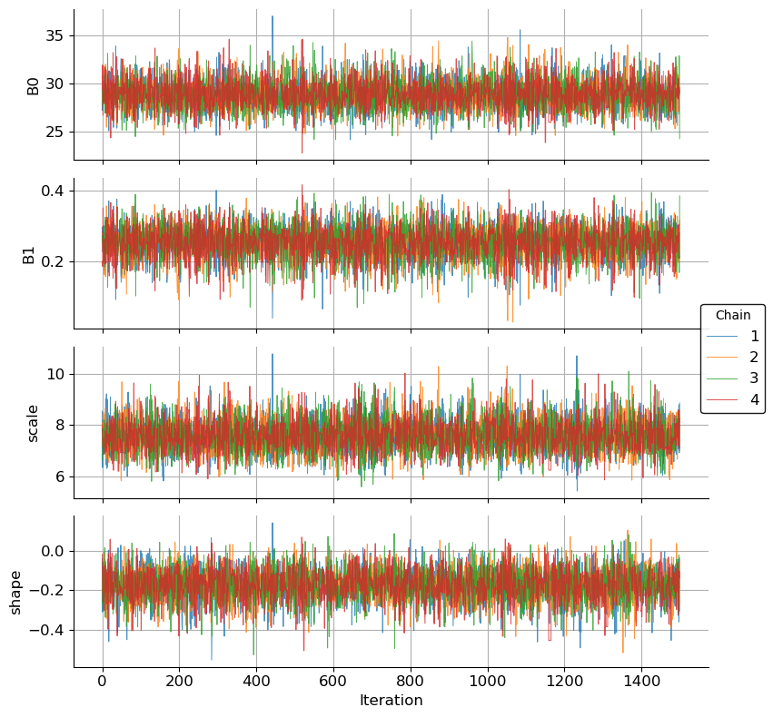
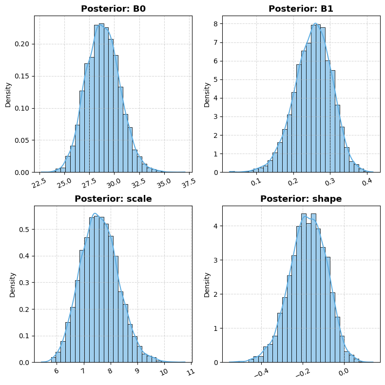

# nsEVDx: A Python Library for Modeling Non-Stationary Extreme Value Distributions

| Usage | Release | Development |
|------|--------|-------------|
|  | [](https://pypi.org/project/nsEVDx/) |  |
|  | [](https://doi.org/10.5281/zenodo.15850043) | [](https://codecov.io/gh/nischalcs50/nsEVDx) |
| [](https://pepy.tech/project/nsEVDx) | [](https://Nischalcs50.github.io/nsEVDx/) | [](https://github.com/nischalcs50/nsEVDx/issues) |
| [](https://github.com/nischalcs50/nsEVDx) | [](https://github.com/pyOpenSci/software-review/issues/265) |  |


`nsEVDx` is a Python library for estimating the parameters of Generalized Extreme Value (GEV) and Generalized Pareto Distributions (GPD), collectively referred to as extreme value distributions (EVDs), under both stationary and non-stationary assumptions, using frequentist and Bayesian methods. Designed for hydrologists, climate scientists, and engineers, especially those working on extreme rainfall or flood frequency analysis, it supports time-varying covariates, MCMC samplings (Metropolis hasting-Randomwalk, Adjusted Langevin Algorithm, Hamiltonian Monte Carlo) and essential model diagnostics. Although developed for environmental extremes, its features are broadly applicable to financial risk modeling and other domains concerned with rare, high-impact events.

## Features

-   Fits stationary and nonstationary EVDs
-   Supports Frequentist and Bayesian inference
-   Transparent, fully customizable MCMC engine implemented in NumPy
-   Advanced samplers: Metropolis Hasting RandomWalk, Metropolis Adjusted Langevin Algorithm (MALA), and Hamiltonian Monte Carlo (HMC)
-   Support arbitratry covariates in location, scale and shape parameters
-   Integrated diagnostic tools: trace plots, acceptance rates, and bayesian metrics
-   Visualization tool for posterior summaries
-   Lightweight and minimal dependency, only `numpy, scipy, matplotlib, seaborn`

## Implementation

The core `NonStationaryEVD` class handles parameter parsing, log-likelihood construction, prior specification, and proposal generation. Frequentist estimation uses `scipy.optimize` to minimize the negative log-likelihood, while Bayesian MCMC methods are implemented in `numpy` for transparency and flexibility.

Non-stationarity is controlled via a configuration vector `config = [a, b, c]`, where each entry specifies the number of covariates used to model the location, scale, and shape parameters of the EVD. Entry with a value of `0` implies stationarity, while values `> 0` indicate non-stationary modeling using that many covariates.

In Bayesian estimation, `nsEVDx` can infer prior specifications based on the data and configuration or accept user-defined priors. In the frequentist mode, it can determine suitable parameter bounds automatically. However, user defined priors or bounds are recommended for better convergence and interpretability.

### Config design

This package allows modeling the extreme value distribution (EVD) parameters as functions of covariates. Each parameter can be configured independently:

-   `location_model`: "constant" or "linear"
-   `scale_model`: "constant" or "exponential"
-   `shape_model`: "constant" or "linear"

Internally, these options apply a regression of the form:

-   Linear: θ(t) = θ₀ + θ₁·X(t)
-   Exponential: θ(t) = exp(θ₀ + θ₁·X(t))

This gives flexibility to model non-stationarity while maintaining parsimony.


Note: Polynomial relationships between the covariates and the parameters can be modeled by raising the power of the covariates before passing them into the model.

Splines : Comming soon...

## Installation

**For regular users**

``` bash
pip install nsEVDx  

# Or clone from GitHub:
git clone https://github.com/Nischalcs50/nsEVDx
cd nsEVDx
pip install .
```

**For developers/contributors**

``` bash
git clone https://github.com/Nischalcs50/nsEVDx
cd nsEVDx
pip install -e .[dev]
```

## Quick Start Example

``` python
import nsEVDx as ns
import numpy as np
from scipy.stats import genextreme
import matplotlib.pyplot as plt

## GIVEN, NON_STATIONARY TIME_SERIES OF EXTREMES
np.random.seed(112)
config = [1, 0, 0] # means location parameter is non-stationary and scale and shape parameters are stationary
# See Usage.md or https://nischalcs50.github.io/nsEVDx/ for more details on config vector
# checking the parameters corresponding to the config
print(ns.NonStationaryEVD.get_param_description(config=config, n_cov=1)) # checking the parameters corresponding to the config
cov  = np.array(range(100))
data = ns.NonStationaryEVD.ns_EVDrvs(genextreme, [30, 0.1, 5, -0.3], cov, config, size=100)
plt.plot(data)


## SETTING PRIORS
# Prior: normal for regression coefficients of location parameter, half-normal for scale, normal for shape
prior_specs = [
    ('normal', {'loc': 30, 'scale':10 }),  
    ('normal', {'loc': 0, 'scale': 0.5}),  
    ('halfnormal', {'loc': 5, 'scale': 5 }),   
    ('normal', {'loc': 0, 'scale': 0.4})  
]
sampler = ns.NonStationaryEVD(config, data, cov,dist=genextreme,
                                  prior_specs=prior_specs)
print(sampler.descriptions)

## RUNNING BAYESIAN ALGORITHM
# fitting a non-stationary GEV model to the data using Hamiltonian Monte Carlo (HMC) sampler
results = sampler.MH_Hmc(
    num_samples=1500, burn_in=1500,
    initial_params=[30, 0, 5, -0.1],
    num_chains=4,
    T = 1
)

## PRINT RESULTS
print(f"acceptance_rate : {np.round(results['acceptance_rates'], 3)}")
print(f"sample mean : {np.round(np.vstack(results['chains']).mean(axis=0), 3)}")
print(f"r_hats : {np.round(results['r_hats'], 3)}")

## PLOT CONVERGENCE & POSTERIORS
ns.plot_trace(results['chains'], config, fig_size=(8,8),show=False);
ns.plot_posterior(results['chains'], config, fig_size=(8,8),show=False);
```




full version of this example is available here: [quick_start](examples/Quick_start_example.ipynb)

## Documentation
-   Webpage manual is here [user manual](https://Nischalcs50.github.io/nsEVDx/)
-   Quick start example 2 is [here](examples/Quick_start_example.ipynb) 
-   See examples such as, [bayesian inference of non-stationary GEV parameters](examples/example_GEV.ipynb), [bayesian metrics example](examples/example_bayesian_metrics.ipynb), [frequentist estimation of non-stationary GPD parameter and likelihood ratio test](examples/example_GPD_frequentist.ipynb), and [generation of random variates from non-stationary GEV](examples/example_generating_rv_from_nsEVD.ipynb) . These examples highlight the library's key capabilities, including parameter estimation and simulation under non-stationary conditions.

## Usage

The usage document is available [here](https://Nischalcs50.github.io/nsEVDx/). For more details, see the usage examples in the Jupyter notebooks [here](examples/).

## Dependencies

-   numpy
-   scipy
-   matplotlib, seaborn (for plots)

## License

This project is licensed under the MIT License - see the [LICENSE](LICENSE) file for details.

## Citation

If you use `nsEVDx` in your research, please cite:

Kafle, N., & Meier, C. I. (2025). nsEVDx: A Python library for modeling Non-Stationary Extreme Value Distributions. arXiv preprint [arXiv:2509.07261](https://arxiv.org/abs/2509.07261).

Kafle, N., & Meier, C. (2025). nsEVDx: A Python Library for Modeling Non-Stationary Extreme Value Distributions (v0.2.3). Zenodo. https://doi.org/10.5281/zenodo.21286163
Jul 10, 2026

## Contributing

Please see [CONTRIBUTING.md](CONTRIBUTING.md) for guidelines on contributing to this project, and refer to our [Code of Conduct](CODE_OF_CONDUCT.md) to foster an inclusive and respectful community.


## References

Betancourt, M. (2017). A Conceptual Introduction to Hamiltonian Monte Carlo. arXiv: Methodology. https://doi.org/10.48550/arXiv.1701.02434

Castillo, E. (1988). Extreme value theory in engineering. Academic Press. https://doi.org/10.1016/C2009-0-22169-6

Coles, S. (2001). An introduction to statistical modeling of extreme values (4th. printing). Springer. https://doi.org/10.1007/978-1-4471-3675-0

Deville, Y. (2026). NSGEV: Non-stationary GEV time series. https://github.com/IRSN/NSGEV/

Eccles, R., Syktus, J., Trancoso, R., Chapman, S., Wasko, C., Evans, J. P., Thatcher, M., Di Virgilio, G., & Stassen, C. (2025). Substantial increases in future precipitation extremes—insights from a large ensemble of downscaled CMIP6 models. Npj Natural Hazards, 2(1), 60. https://doi.org/10.1038/s44304-025-00107-1

Foreman-Mackey, D., Hogg, D. W., Lang, D., & Goodman, J. (2013). Emcee: The MCMC hammer. PASP, 125, 306–312. https://doi.org/10.1086/670067

Gilleland, E. (2025). extRemes: Extreme Value Analysis. https://doi.org/10.1175/JTECH-D-20-0070.1

Heffernan J. E., Stephenson A.G., & Gilleland E. (2003). Ismev: An Introduction to Statistical Modeling of Extreme Values. https://doi.org/10.32614/CRAN.package.ismev

Hosking, J. R. M., & Wallis, J. R. (1997). Regional Frequency Analysis: An Approach Based on L-Moments (Vol. 93). Cambridge University Press. https://doi.org/10.1017/CBO9780511529443

Jayaweera, L., Wasko, C., & Nathan, R. (2025). Evidence for non-stationarity in the GEV shape parameter when modeling extreme rainfall. Water Resources Research, 61(5), e2023WR036426. https://doi.org/10.1029/2023WR036426

Kafle, N. (2026). Rain-gauge network effects on the uncertainty and trends in short-duration extreme precipitation (PhD Dissertation No. 32785789, The University of Memphis). https://ezproxy.memphis.edu:3443/login?url=https://www.proquest.com/dissertations-theses/rain-gauge-network-effects-on-uncertainty-trends/docview/3369343212/se-2

Kafle, N., Dell’Aira, F., Chadwick, C., & Meier, C. I. (2026). (Forthcoming.) robustness of regionally derived, short-duration rainfall depth-duration-frequency estimates to the choice of minimum interevent time: Evidence across climates, raingauge densities, and regionalization approaches. Journal of Hydrologic Engineering. https://doi.org/10.1061/JHYEFF.HEENG-6729

Kafle, N., Peleg, N., & Meier, C. I. (2025). Detecting spatially consistent trends in sub-hourly extreme rainfall using a neighborhood-based method. AGU Fall Meeting Abstracts, 2025, H13G–07. https://ui.adsabs.harvard.edu/abs/2025AGUFMH13G...07K/abstract

Katz, R. W., Parlange, M. B., & Naveau, P. (2002). Statistics of extremes in hydrology. Advances in Water Resources, 25(8–12), 1287–1304. https://doi.org/10.1016/S0309-1708(02)00056-8

McNeil, A. J., & Frey, R. (2000). Estimation of tail-related risk measures for heteroscedastic financial time series: An extreme value approach. Journal of Empirical Finance, 7(3–4), 271–300. https://doi.org/10.1016/S0927-5398(00)00012-8

Neal, R. M. (2011). MCMC using hamiltonian dynamics. In S. Brooks, A. Gelman, G. L. Jones, & X.-L. Meng (Eds.), Handbook of markov chain monte carlo (pp. 113–162). CRC Press. https://doi.org/10.1201/b10905

Oriol Abril-Pla, Virgile Andreani, C. Carroll, L. Y. Dong, Christopher Fonnesbeck, Maxim Kochurov, Ravin Kumar, Junpeng Lao, Christian C. Luhmann, Osvaldo A. Martin, Michael Osthege, Ricardo Vieira, Thomas V. Wiecki, & Robert Zinkov. (2023). PyMC: A modern, and comprehensive probabilistic programming framework in Python. PeerJ Computer Science, 9, e1516–e1516. https://doi.org/10.7717/peerj-cs.1516

Paciorek, C. (2016). climextRemes: Tools for Analyzing Climate Extremes. https://doi.org/10.32614/CRAN.package.climextRemes

Phan, D., Pradhan, N., & Jankowiak, M. (2019). Composable effects for flexible and accelerated probabilistic programming in NumPyro. arXiv Preprint arXiv:1912.11554. https://doi.org/10.48550/arXiv.1912.11554

Prosdocimi, I., Kjeldsen, T. R., & Miller, J. D. (2015). Detection and attribution of urbanization effect on flood extremes using nonstationary flood-frequency models. Water Resources Research, 51(6), 4244–4262. https://doi.org/10.1002/2015WR017065

Robert, C. P., & Casella, G. (2009). Introducing Monte Carlo Methods with R. https://doi.org/10.1007/978-1-4419-1576-4

Roberts, G. O., & Tweedie, R. L. (1996). Exponential Convergence of Langevin Distributions and Their Discrete Approximations. Bernoulli, 2(4), 341. https://doi.org/10.2307/3318418

Stan Development Team. (2023a). CmdStan: The command-line interface to Stan. https://doi.org/10.5281/zenodo.1117248

Stan Development Team. (2023b). PyStan: The python interface to Stan. https://doi.org/10.5281/zenodo.1456206

